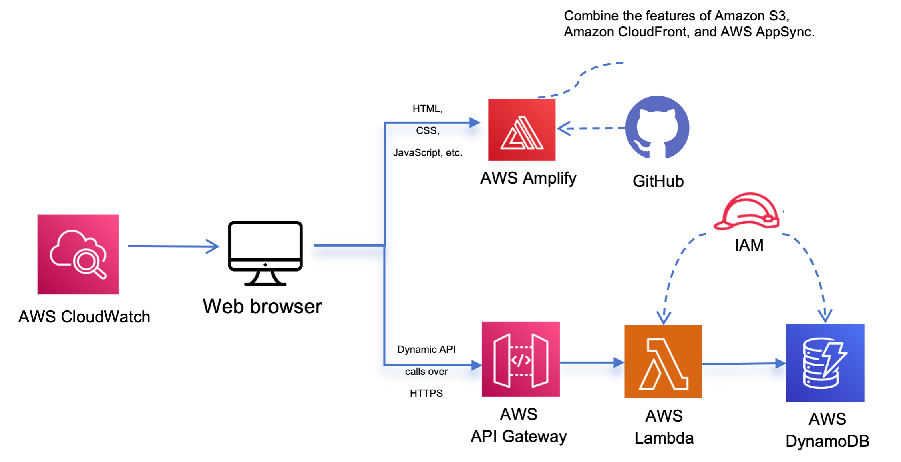

# Webook - Single Page Education Website

This is a final group project for **COM6102 Distributed Systems and Cloud Computing (2024 Spring)**.
(Adapted from [source](https://github.com/SM8UTI/Webook-online-education-website)) 

Contributors: Y. Wang, Y. Ge, L. Lin, X. He.(Group 6)


Application Website : [https://master.d3akmlv2vkrixn.amplifyapp.com/](https://master.d3akmlv2vkrixn.amplifyapp.com/)


YouTube : (To be updated...)

<br/>

## Overview
In this project, we aim to build and deploy a single-page web application (named “Webook”) that enables users to explore the marketing information of online courses provided by Webook. This application presents users with an HTML-based interface with a RESTful web service on the backend to submit their enquiries.

<br/>
The main components of the website are: 

- Course introduction, Lecturer introduction, FAQs, Contact messages and other functions, where:
    - **Contact messages** contains the most important feature of this application

We adpated the original webpage, JavaScipt file and python programme to be compatible with the AWS services applied.

<br/>
Specially, this application integrates several AWS cloud services including:

- **AWS Amplify**: providing continuous deployment and hosting of static web resources (HTML, CSS, JavaScript, images, etc.)
- **API Gateway** and **Lambda**: building a public backend API that receives data and triggers a Lambda function to store the data into the database
- **DynamoDB**: providing a persistent layer where data can be stored by the Lambda function
- **IAM**: providing secure access for the Lambda function to store data into DynamoDB
- **CloudWatch**: monitoring application performance and resource use
  
<br/>

## Architecture




## Security Concerns 

These AWS services are applied for security concerns:
<br/>
1.	**Amplify** is a powerful tool with many built-in security features that can help protect applications and data. It provides data encryption capabilities that can encrypt data during data transmission and storage to protect sensitive information from being Acquired by unauthorized visitors. We use these features to ensure that applications comply with regulations and standards for privacy and data security.
2.	**API Gateway** is used to securely expose and manage APIs. Through API Gateway, access control policies can be implemented to ensure secure interactions between front-end and back-end.
3.	**IAM** is AWS's authentication and access control service, used to manage access to AWS resources. Through IAM, we can grant write access for Lambda to store data in DynamoDB.

<br/>

## 🌍 Building Steps

**Step 1 — Deploy applications using Amplify and GitHub**

**Step 2 — AWS Lambda Serverless Function**

**Step 3 — Connect the Lambda function to the web application**

**Step 4 — Create DynamoDB table**

**Step 5 — IAM Policies and Permissions**

**Final step — Test the web application**


<br/>


## 📁 File Structure

```
|   index.html // Index Html File 
|   README.md  // Readme File 
|   Webook.fig // Figma File 
|
\---app // All Files or Images 
    +---images
    |   |   ba1.png
    |   |   causal.png
    |   |   menu-alt.png
    |   |   menu-x.png
    |   |   preloader.gif
    |   |
    |   \---logo
    |           Favicon.svg
    |           logo.svg
    |
    +---js
    |       script.js // Main Javascript file 
    |
    \---scss
        |   style.css // Main Style CSS File
        |   style.css.map
        |   style.scss // Main Style SCSS File 
        |
        +---components // Here present all of components 
        |       _about.scss
        |       _banner.scss
        |       _classes.scss
        |       _contact.scss
        |       _courses.scss
        |       _expert.scss
        |       _faq.scss
        |       _features.scss
        |       _footer.scss
        |       _header.scss
        |       _index.scss
        |       _preloadder.scss
        |       _subscribe.scss
        |
        +---global // Here present all Default Html code and Color Codes 
        |       _boilerplate.scss
        |       _colors.scss    // All Colours file 
        |       _fonts.scss     // Font File 
        |       _images.scss    // Images url File 
        |       _index.scss
        |       _typography.scss
        |
        \---util
                _breakpoints.scss // Media Query Function 
                _functions.scss   // Some function 
                _index.scss
```

<br/>


## 💻 Screenshot


<br/>
